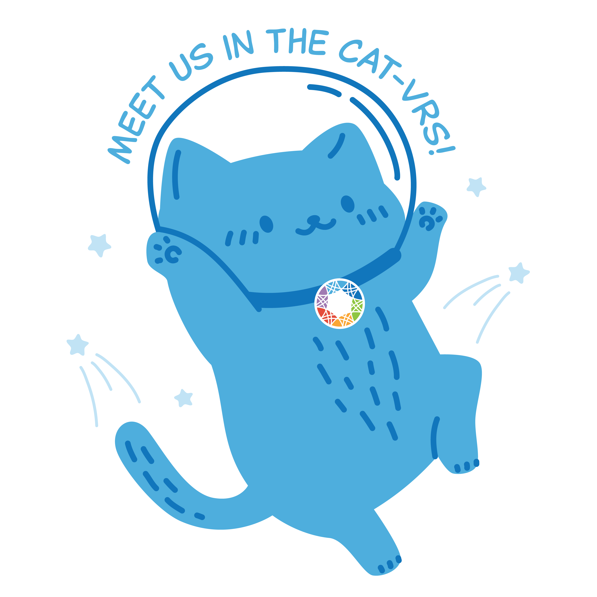

# Cat-VRS

[A terminology and data model for describing categorical variation concepts](https://vrsatile.readthedocs.io/en/latest/catvars/index.html), built on top of the
[GA4GH Variation Representation Specification (VRS)](https://vrs.ga4gh.org).

# How to set up a venv and update the schemata from the source.yaml files: (Guide for VSCode)

1. Use the following code to install the venv in the root directory that contains the requirements.txt file.  Note that requirements.txt may be hidden and not show up with `ls`, but it should show up if you ise `ls -a` to list hidden files.
    > `python3 -m venv venv`
    >
    > `source venv/bin/activate`
    >
    > `pip install -U setuptools pip`
    >
    > `pip install -r .requirements.txt`
2. Then run the following code to pull in all of the submodule content:
    > `git submodule update --init --recursive`
3. The venv should be all set up to update the `.rst` files as they are updated. `.rst` files inside the `docs/source` directory are static and can be edited directly.  (you will need to install aan `.rst`-compatible extension to view the outputs inside the editor, however.  I currently have both reStructuredText and RST Preview installed.) The `.rst` and `.json` files for the schemata are generated by making edits to the `-source.yaml` files, and thenrunning the `Makefile`.  To run the `Makefile`, `cd` into the `cat-vrs/schema` directory which contains it and run the following line of code to update everything:
    > `make all` 