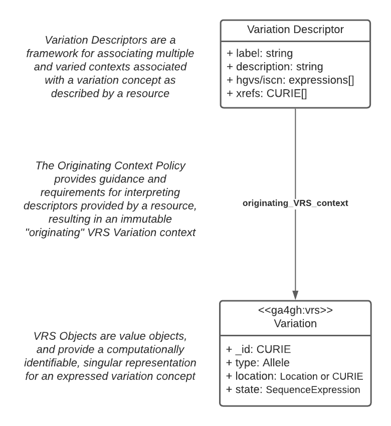

**VRS Added Types for Interoperable Loquacious Exchange (VRSATILE; prounounced "versatile")** is a set of proposed extensions for VRS to enable interoperable exchange of common descriptive metadata alongside variation concepts. This also enables simplification of "aggregate" variation concepts that include multiple contextual forms. Examples of aggregate variation include the concepts represented by ClinVar variation IDs, CIViC variation IDs, ClinGen Allele Registry Canonical Allele IDs, and dbSNP Reference SNP IDs.

