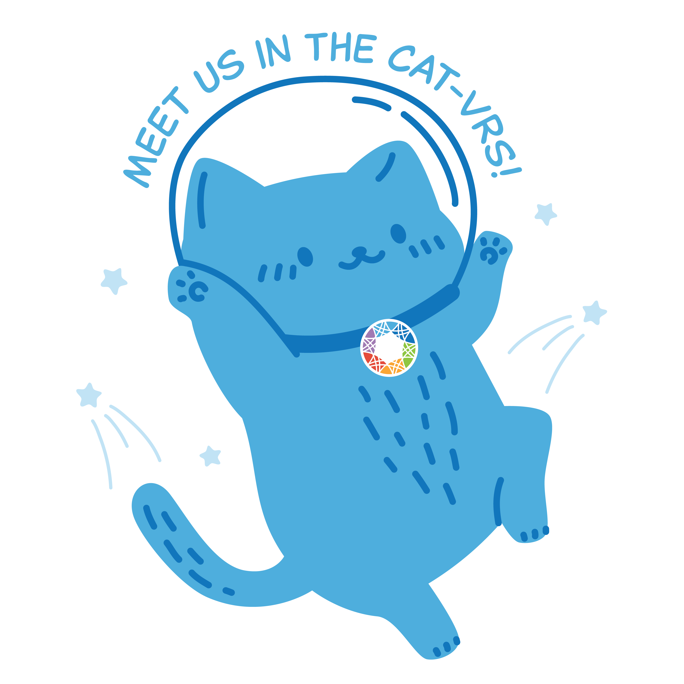

# Categorical Variation Representation Specification (Cat-VRS)

**Cat-VRS 1.0.0 Trial Use Review November 2024 - join in [here](https://github.com/ga4gh/cat-vrs/discussions/86)**!

The [GA4GH](https://www.ga4gh.org/) [Categorical Variation Representation Specification](https://www.ga4gh.org/product/categorical-variation-catvar/) provides a [terminology and data model for describing categorical variation concepts](https://cat-vrs.readthedocs.io/en/latest/index.html), built on top of the [GA4GH Variation Representation Specification (VRS)](https://vrs.ga4gh.org). Cat-VRS is the result of a collaboration among [contributors](CONTRIBUTORS.md) representing national information resource providers, major international public initiatives, and bioinformatics laboratories.

Cat-VRS is licensed under the [Apache License 2.0](LICENSE).

# Test Set

Categorical variant classes intended to be covered by this specification can be [appended to this CatVar test set document](https://docs.google.com/document/d/1aV-SqxdmuRN_EKvafzTSe0GoGC9yOzPsjrdWE0LXqYc/edit) to direct future specification development efforts.

## Using the schema

The schema is available in the [schema/](./schema/) directory, in both yaml and json versions.
It conforms to JSON Schema Draft 2020-12. For a list of
libraries that support JSON schema, see
[JSONSchema>Tools](https://json-schema.org/tools).

## Installing for development

[Fork the GitHub repo](https://github.com/ga4gh/cat-vrs/fork).

Then, clone your fork and initialize a development environment:

    git clone --recurse-submodules git@github.com:YOUR_GITHUB_ID/cat-vrs.git
    cd cat-vrs
    make devready
    source venv/3.12/bin/activate

If you already cloned the repo, but forgot to include `--recurse-submodules` you can run:

    git submodule update --init --recursive

## Contributing to the schema

Cat-VRS uses [cat-vrs-source.yaml](./schema/cat-vrs/cat-vrs-source.yaml) as the source
document for JSON Schema.

To create the corresponding def and json files after making changes to the source
document, from the root directory:

    cd schema
    make all

After regenerating the corresponding def and json files from your changes, validate your changes locally by running the updated schema against the current [examples/](./examples). This will be automatically run as a [GitHub action](https://github.com/ga4gh/cat-vrs/actions/workflows/tests.yml) upon pushing changes to GitHub. From the root directory:

    pytest tests/

Please do not forget to commit schema and recipe changes to [`schema/cat-vrs/def/`](./schema/cat-vrs/def/) and [`schema/cat-vrs/json/`](./schema/cat-vrs/json/), in addition to changes to [`schema/cat-vrs/cat-vrs-source.yaml`](./schema/cat-vrs/cat-vrs-source.yaml) and [`schema/cat-vrs/recipes.yaml`](./schema/cat-vrs/recipes-source.yaml).

## Contributing to the docs

The Cat-VRS specification documentation is written in reStructuredText and located in
[docs/source](docs/source/). Commits to this repo are built automatically at
<https://cat-vrs.readthedocs.io/en/latest/index.html>.

To build documentation locally, you must install [entr](https://eradman.com/entrproject/):

    brew install entr

Then from the root directory:

    cd docs
    make clean watch &

Then, open [docs/build/html/index.html](./docs/build/html/index.html). The above make
command should build docs when source changes. (Some types of changes require recleaning and building.)