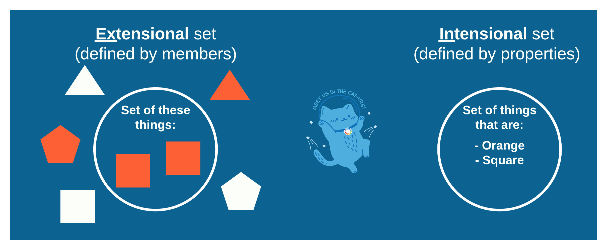
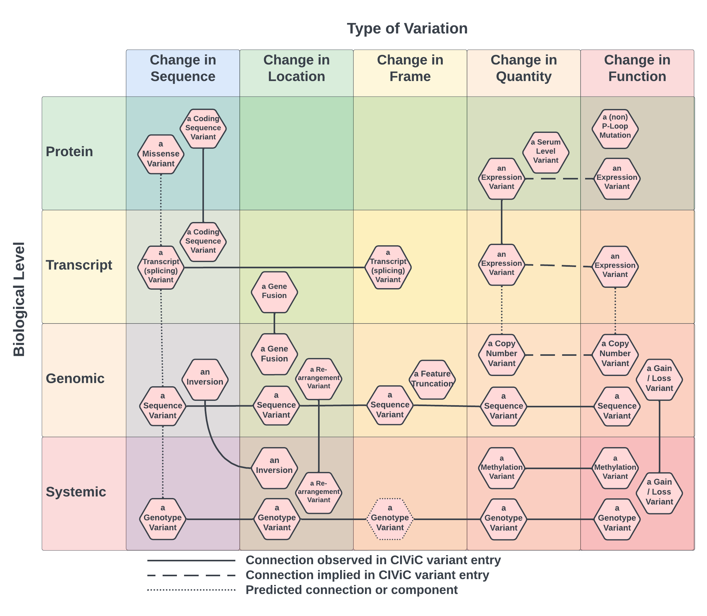

.. _hyperintensional-catvars:

Treatment of CatVars as ((Hyper)intensional) Set-Theoretic Objects
!!!!!!!!!!!!!!!!!!!!!!!!!!!!!!!!!!!!!!!!!!!!!!!!!!!!!!!!!!!!!!!!!!

Catvars as Sets
@@@@@@@@@@@@@@@

**Decision:**
The group decided to formally model catvars as sets.

**Rationale:**
In `Patterson, Stats, Yin, and Mockus 2019
<https://www.nature.com/articles/s41698-018-0073-y>`_, it was observed that:

  “The JAX-CKB also incorporates higher order variants to accommodate unspecified variants, such as EGFR mutant, EGFR act mut (for EGFR activating mutation), and EGFR exon 19 deletion. These higher order, or “category”, variants enable curation of data where the specific alteration present is not identified.”

This is one of the first concrete definitions of “category” variants, and where the term that later evolved into categorical variants (catvars) was coined. This notion of catvars as being unspecified (and in some sense higher-order) variants does help distinguish them from variants describing specific alterations, in what they aren’t: not specific in some relevant sense. Given that the problems relating to catvar representation occur most often in the context of genomics knowledgebases, it was also frequently noted that catvars are often the subjects (in the grammatical sense) of genomic knowledge statements, and serve as links to genomic knowledge statements. For example, the string “TP53 Loss” in the proposition below:

#. TP53 Loss is associated with increased risk of cancer.
#. [TP53 Loss]\ :sub:`Subject`\  [is associated with]\ :sub:`Predicate`\  [increased risk of cancer]\ :sub:`Object`\

However, this is a description of how catvars are used, not what they are. Thus it was one of the first priorities of the then-CatVar study group to attempt to describe what catvars are, by way of collecting examples. It soon became obvious that most commonly described catvars, such as TP53 Loss variants, EFGR Exon 18-21 Deletions, or BRAF V600E describe classes of possible assayed variants: variants directly observed from a sequencing assay. Indeed, many example catvars, contain hyper-cosmologically large numbers of possible members [#]_, or even infinitely large sets, such as any non-length constrained set of insertions. Even fairly specific variants in knowledgebases could be understood to in fact represent a set of assayed variants, such as a specific nucleotide variant corresponding to multiple variant records in the context of different transcripts or genome reference builds. Indeed, after much discussion, it became clear that all catvars could be described as sets of contextual variants [#]_, where in contrast to the member variants, the catvar itself is not contextualized to a patient or genome, but rather to a knowledgebase.

Catvars as Intensional Sets
@@@@@@@@@@@@@@@@@@@@@@@@@@@

**Decision:**
The group decided to model CatVars as intensional set objects rather than as extensional sets.

**Rationale:**

There are two ways to model these sets, as extensional set objects or intensional set objects.

   Figure 1: Extensional vs intensional sets

**Catvars as Extensional Set Objects**
As seen in Figure 1, you *can* define a set by its members, its *extensions*. In terms of types and matching, this is often the simplest approach to take, as the members can be of any arbitrary type, and matching something to the set simply consists of checking the members of the set until you either find your target among them, in which case you know your thing is a member of the set, or until you run out of members to check, in which case you know the target is *not* a member of the set.

There are, however, a number of implementation challenges with purely extensional sets in this context. One clear problem, and in our regard sufficient to rule out this approach, is that, as we observed above, the cardinality of many catvars (the number of members in the set) are often hyper-cosmologically big, or not even finite at all. Attempting to loop through and check all the members of these sets are computationally impractical [#]_ and impossible, respectively. Therefore, an extensional approach to representing catvars is a nonstarter.

**Catvars as Intensional Set Objects**

An alternative is to represent catvars as intensional set objects, that is, to define the set according to the common properties of its members. This approach is more complex with respect to matching, but has the potential to be much more efficient than in the extensional case. Whereas matching to extensional sets simply meant comparing each of the set members against a target, matching to an intensional set requires matching the set’s properties (also called constraints on membership) against the target’s properties. This is more complicated because it requires additional abstract data types over these properties, and more sophisticated techniques to efficiently parse out and match to (sets of) properties in non-trivial cases.

However, the advantage here is that while many catvars have an infinite number of potential extensions, these same catvars are readily describable by a small (finite!) number of properties. As shown in Figure 2, this approach also proved effective in a previous typological analysis of catvars in the CIViC knowledgebase, where the columns correspond to a coarse-grained set of intensional properties required for catvar membership. Based on this and related considerations, it was proposed to model catvars as intensional set objects.

ity, or function).
   :align: center

   Figure 2: A coarse-grained typology of catvars in the CIViC knowledgebase

Catvars as Hyperintensional Set Objects
@@@@@@@@@@@@@@@@@@@@@@@@@@@@@@@@@@@@@@@

**Decision:**
The group decided to adopt a hyperintensional semantic model for catvars (as opposed to a merely intensional model).

**Rationale:**
`Hyperintensionality
<https://plato.stanford.edu/entries/hyperintensionality/>`_ is a property of a model wherein two sets, though identical with respect to their intensions, are treated as distinct sets that can be differentiated.

An intensional model will not suffice in the case of catvars, which reflects a more general trend in the formal modelling of human knowledge and beliefs. The issue relates to the fact that two catvars can have the same properties, and yet be useful to distinguish. To give an example from mathematics in order to illustrate the intuition, consider the following two propositions: ‘2 + 2 = 4’ and ‘Fermat’s last theorem is true.’ Both of these propositions share the same relevant property: They are each consistent with the axioms of number theory, and are true. However, between 1637 when Fermat published his theorem, and 1994 when it was proven to be true, no human knew if this was the case or not. This is important, because from the perspective of a merely intensional model of human knowledge, since, as it turns out, both propositions have the same properties, then knowing one, ‘that '2 + 2 = 4' is true’ would necessarily imply that one also knows the other, ‘that ‘fermat’s last theorem is true’ is true’. This was obviously not the case for three and a half centuries, so human knowledge cannot be modelled merely intensionally, but requires hyperintensionality. Another example of hyperintensionality in human belief comes from the following two, logically interchangeable beliefs: ‘The cup is half full’ versus ‘the cup is half empty’. Any situation where the first belief is obtained, the second is as well. And yet we usefully distinguish people who hold the former belief as optimists from those who espouse the latter as killjoys.

In the realm of genomics, the same facts hold. Catvars are labels created by humans to reflect certain beliefs about distinctions of clinical and/or methodological importance. Consider the following four catvars in example (1) below. All four labels represent the same identical underlying protein missense variant, in the context of different nomenclature systems.

#. Several catvars:
    #. 7-14075336-A-T
    #. NM_004333.6:6.1799T>A
    #. rs113488022
    #. BRAF p.V600E

While this may at first blush appear to be merely a use-case for variation normalization, different names for the same catvar can have vastly different kinds of knowledge associated with them. Suppose we have some three labels that, as with the above example, represent the same underlying genomic variation. One is an HGVS expression denoting a large nucleotide sequence deletion. The second is an ISCN string denoting a loss of a cytoband region, and the third label denotes a star-allele. Even though our rhetorical variant in the genome is the exact same in all three cases, these different labels imply very different things about that variant. The HGVS vs ISCN labels are clues as to which laboratory techniques (molecular vs cytogenetic) that can be used to observe this variant. In a similar way, the star allele label specifically implies a link to pharmacogenomic consequences of this variant, knowledge that may well not be attached to either of the first two labels. A hyperintensional model can represent these three catvars in parallel, and still be compatible with future normalization/harmonization. A merely intensional model would not afford us this flexibility.

Therefore, based on the above considerations, it was proposed to model catvars as hyperintensional set objects.

.. rubric:: Footnotes

.. [#] Consider for example the catvar “EGFR exon 19 sequence variants”, of which there are some 10\ :sup:`125` possible members, assuming only length-preserving variants. For a sense of scale, a liberal upper estimate on the number of atoms in the observable universe is on the order of 10\ :sup:`80` .

.. [#] Even a single, specific variant, for example, a novel genomic mutation that has only ever been recorded in one transcript and in one patient, can correspond to a categorical variant removed from the context of the individual patient, and described as a singleton set - a set with only a single member. Therefore, even cases of singletons can be handled via a set theoretic modelling approach.

.. [#] Returning to the example of “EGFR exon 19 sequence variants”, if every atom in the universe were a computer, and each of those computers were capable of checking 1 trillion members per second, it would still take approximately 2,500,000,000,000,000 times the current age of the universe to check every possible member of that set.
