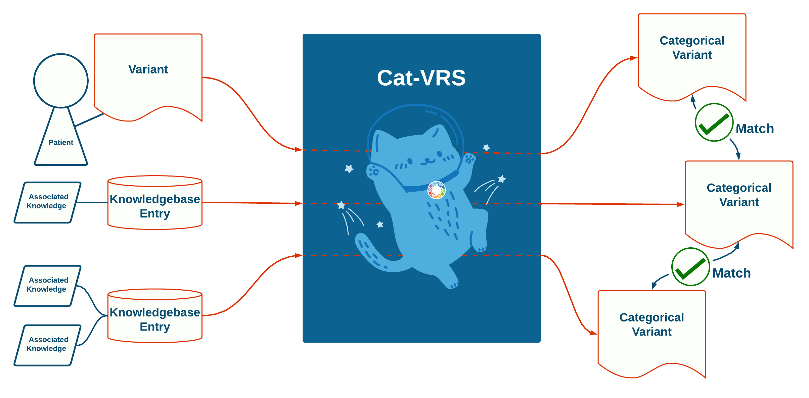
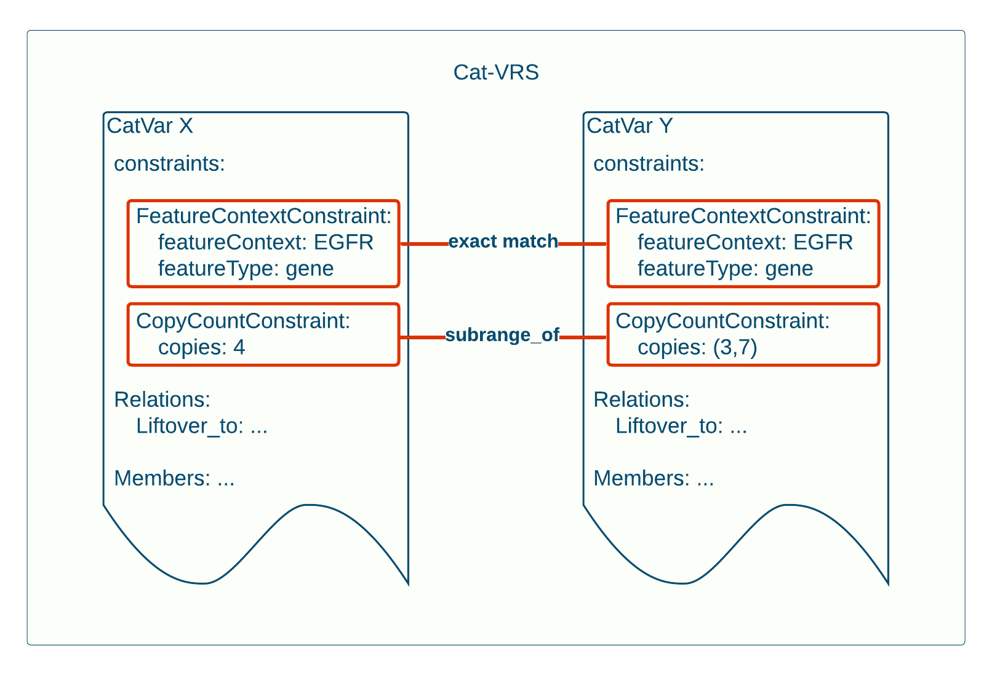
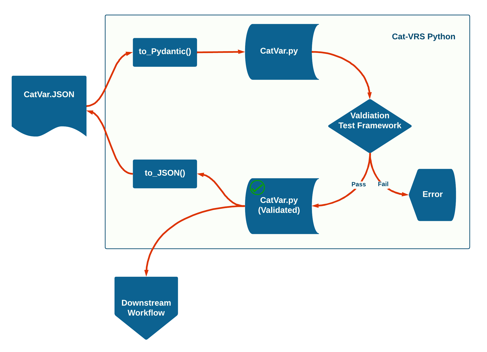

How Cat-VRS Works
!!!!!!!!!!!!

.. Short Problem statement.

The constraint-based data model of Cat-VRS allows for the precise, flexible, and computable representation of catvars.  In this section, we discuss how this constraint-based Cat-VRS data model model addresses our use cases.

Variant Matching and Knowledge Integration
@@@@@@@@@@@@@@@@@@@@@@@@@@@@@@@@@@@@@@@@@@

.. Knowledgebase Entries as CatVars

Entries in genomics knowledgebases typically pertain to sets of assayed variation, and are therefore categorical variants by definition.  However, with a myriad of idiosyncratic representations, they are extremely difficult to match.

.. Categorical Representations of Assayed Variants

Likewise, assayed variants come in a variety of representations, and are difficult to match to the equally varied categorical variants represented in knowledgebases.  While assayed variants represent a single variant in a real-world context, they can still be converted into a Cat-VRS representation, with, at worst, the resulting catvar merely representing a singleton set.

.. Variant matching with Cat-VRS

The figure below shows how variant matching via Cat-VRS effectuates knowledge integration.  On the left is an assayed variant from a patient, and two knowledgebase entries, each with associated genomic knowledge, which are siloed.  However, by representing them with Cat-VRS, each are converted into categorical variant representations under a single common representation specification.  As a result, the Cat-VRS representations become easily comparable with each other, and both assayed-to-categorical and categorical-to-categorical variant matching becomes possible under a common framework. By extension, the knowledge of each respective knowledgebase entry can be integrated as part of knowledgebase curation, or applied to the assayed variant of interest in clinical pipelines.

ng them with Cat-VRS, each are converted into categorical variant representations under a single common representation specification.  As a result, the Cat-VRS representations become easily comparable with each other, and both assayed-to-categorical and categorical-to-categorical variant matching becomes possible under a common framework. By extension, the knowledge of each respective knowledgebase entry can be integrated as part of knowledgebase curation, or applied to the assayed variant of interest in clinical pipelines.

.. Matching by Constraints

The ability of Cat-VRS to match between catvars derives from the same formal elements that mediate the flexibility and precision of the data model itself, the constraints.  The constraints in a catvar intensionally define its set of member variants.  Therefore, to compare sets for matching, we need only to compare the constraints of those respective catvars.  In this manner, it is straightforward to compute the relationship, if any, between any two given catvars in Cat-VRS, as demonstrated below.

rence in the CopyCountConstraint, however, shows that the feature copies required for CatVar X, 4, is a sub-range of that for CatVar Y, 3-7, and so therefore CatVar X is a proper subset of CatVar Y.

Both catvars X and Y in this example are composed of constraints.  And in this case, catvars X and Y each satisfy the same two constraints, the FeatureContextConstraint and the CopyCountConstraint, and no others.  We can therefore compute the relationship between these two catvars simply by checking each pair of matching constraints.  In this case, the FeatureContextConstraint in each catvar is identical:  They both pertain to the EGFR Gene, and are no more specific than that.  In the CopyCountConstraint, things get a little more interesting.  CatVar X requires exactly 4 copies of the gene (equivalently an exact range of (4,4) copies), while CatVar Y requires an integer number within a range of 3 to 7 copies.  We can therefore compute that the copies required of CatVar X is a sub-range of that specified for CatVar Y.  Based on the results of comparing these constraints, we can likewise conclude that CatVar X constitutes a proper subset of CatVar Y. This insight allows us to integrate genomic knowledge between them. Since we now know that X is a proper subset of Y, if we supposed that CatVar Y is associated with some knowledge tying variation of 3-7 copies in EGFR with some phenotypic outcome, we can also apply that knowledge to CatVar X as well.

.. Cat-VRS Python

While support and reference tooling will continue to be built out as Cat-VRS gains adoption and specific use cases are brought to the group, we do already have wheels on the ground in the form of `Cat-VRS Python, which can be viewed in this GitHub repository. <https://github.com/ga4gh/cat-vrs-python>`_

An overview of Cat-VRS Python's core functions is depicted in the figure below.  Cat-VRS Python can take in Cat-VRS objects as JSON, convert them into Pydantic models for use in validation against a test suite.  Validated catvars can be converted back to JSON for broad compatibility with other Cat-VRS implementations or used in downstream Python-based informatics workflows.

n error.  Once validated, CatVar.py objects can either be made available to other downstream Python informatics workflows or exported back to JSON for other uses.

Discussion
@@@@@@@@@@

In summary, the very formal components of the Cat-VRS data model that are required to allow for the precise, flexible, and computable representation of categorical variants, the constraints, can also be leveraged in implementations of Cat-VRS to address our core use cases in assayed-to-categorical matching, categorical-to-categorical variant matching, and knowledge integration and curation.
