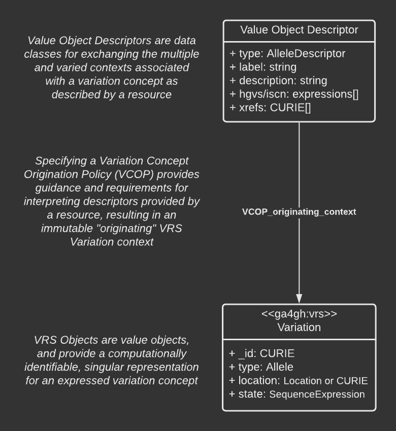

GA4GH VRSATILE
!!!!!!!!!!!!!!

.. note::

   VRSATILE is as Driver Project initiative to guide extending VRS in practical,
   real-world data exchange. **The contents of this resource are not a GA4GH
   standard**. As the demonstrated utility of VRSATILE specification components
   become clear through Driver Project feedback and adoption, we will advance those
   components as proposed standards.

**VRS Added Types for Interoperable Loquacious Exchange (VRSATILE;
prounounced "versatile")** is a set of proposed extensions for
|vrs| to enable interoperable exchange of common descriptive data alongside
variation concepts. Common examples of this are reference sequence ids,
`HGVS`_ descriptors, associated concept ids, and community aliases such as
*EGFR vIII*. VRSATILE and its components are in a draft state and a reflection
of current Driver Project interoperability efforts based on the VRS standard.

VRSATILE also enables simplification of "aggregate" variation concepts
that include multiple contextual forms. Examples of aggregate variation
include the concepts represented by `ClinVar`_ variation IDs, `CIViC`_
variation IDs, `ClinGen Allele Registry`_ Canonical Allele IDs, and `dbSNP`_
Reference SNP IDs.

   **Overview of the VRSATILE Framework**

.. toctree::
   :maxdepth: 2
   :includehidden:

   value_object_descriptor/framework
