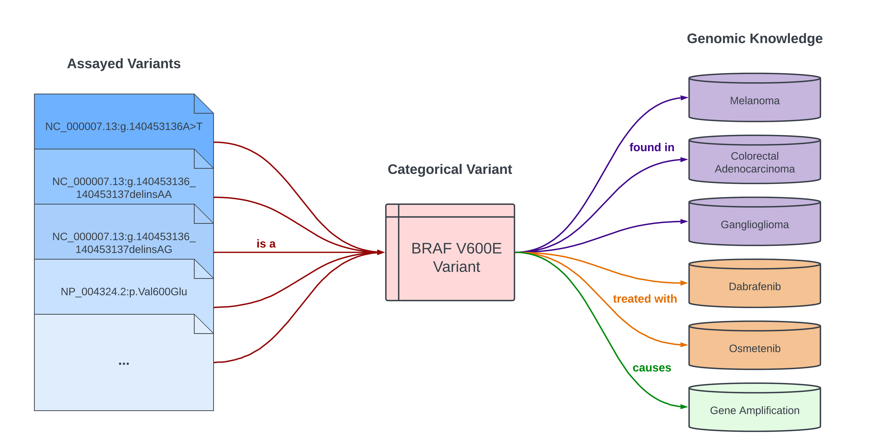
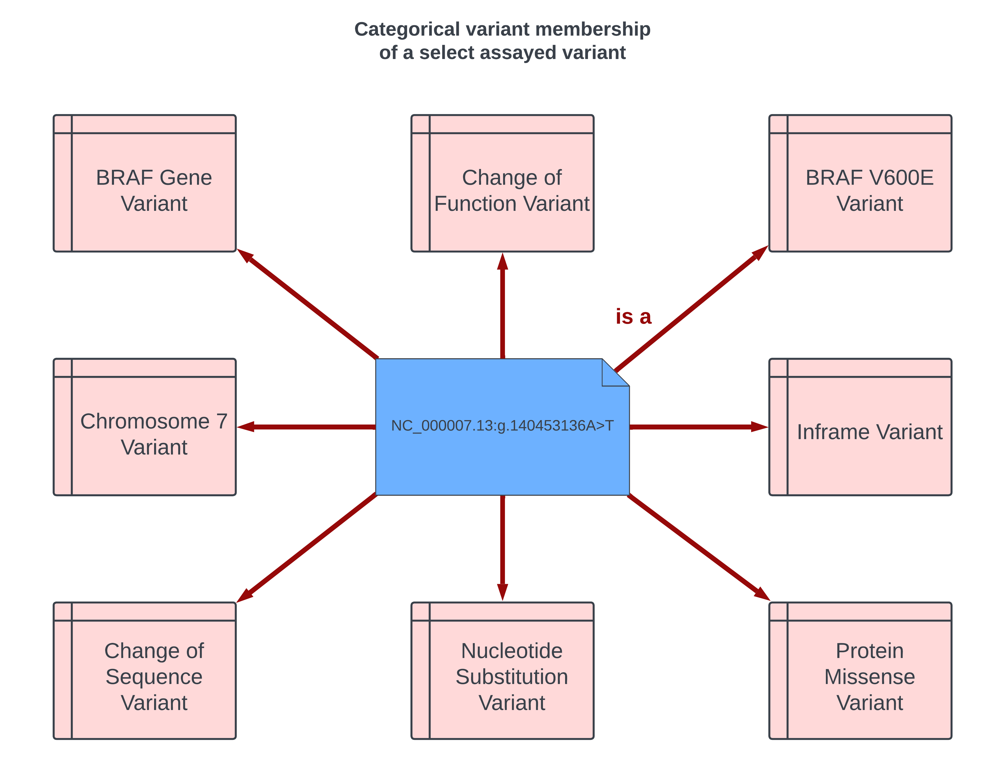
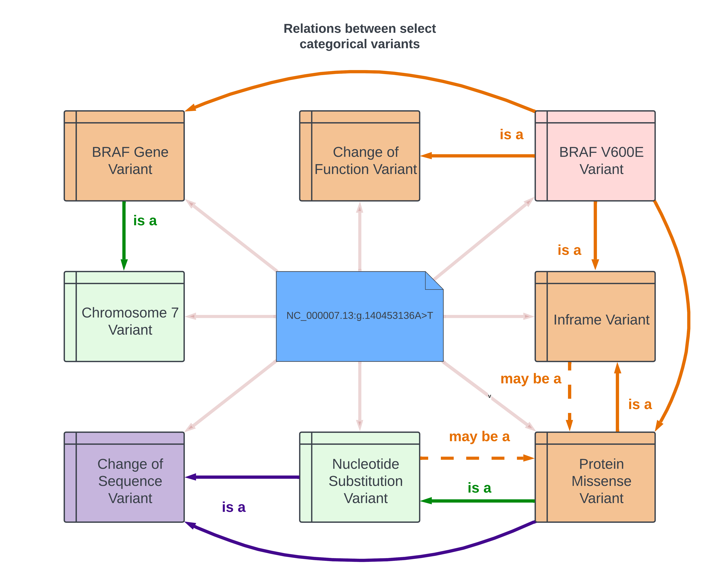
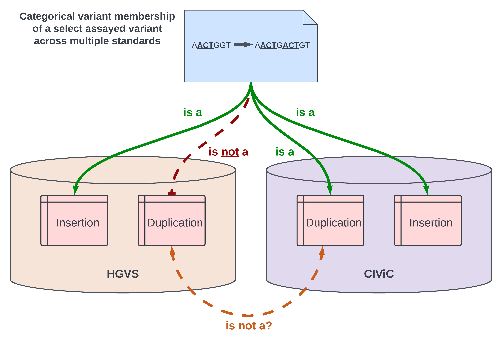
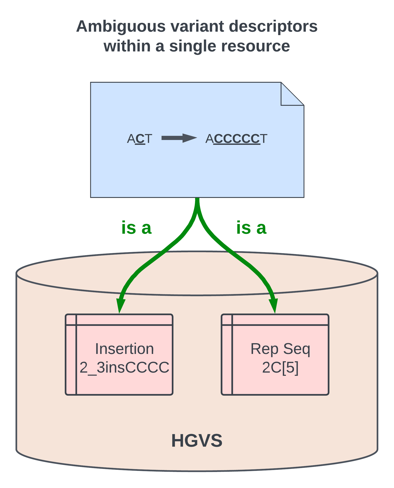

Introduction
!!!!!!!!!!!!

.. Short Problem statement.

The Categorical Variation Working Group is developing a data framework and specification for a computable model of categorical variants. This is related to broader GA4GH efforts to streamline genomic knowledge standards across disparate genomic knowledge repositories. A categorical variation representation specification is required to facilitate the needs for storing, searching, and interpreting knowledge related to both individual genomic variants and the categories of variation to which they belong.

Background and Problem Statement
@@@@@@@@@@@@@@@@@@@@@@@@@@@@@@@@

.. Variant interpretation

Genomic medicine is the discipline of interpreting genomic information about an individual as part of their clinical care for diagnosis, prognosis, or therapeutic decision-making. Integral to the practice of genome interpretation is the collection of multiple lines of evidence from disparate genomic data resources to support or refute the clinical significance of evaluated variants. However, this process is rarely as straightforward as exact pattern matching.  The reason for this complication comes from a subtle but crucial difference between the information that the analyst posesses and the information to which evidence is typically attached in knowledgebases.

.. Analyst has an assayed variant

Suppose an analyst is interpreting a variant, NC_000007.13:g.140453136A>T, that was assayed in a patient.  This *assayed variant* label represents one specific genomic variant.  However, the evidence connected with this variant and its association with cancer are often not directly attached to that exact assayed variant.  Rather, the variant NC_000007.13:g.140453136A>T belongs to a larger class of related variants, BRAF V600E variants, and the underlying evidence items are associated with this class label.

00E is connected to a variety of genomic knowledge statements, such as being found in various cancers, having implications for drug sensitivity, and that its effect is that of gene amplification.

.. What a catvar is

This class, *BRAF V600E*, is a *categorical variant*, so-called because it represents an entire category of variation.  Categorical variants are  sets of properties related to different dimensions of genomic and biological variation.  The members of a categorical variant are individual assayed variants.

.. KB has categorival variants

To return to our rhetorical analyst, the variant they are interpreting, NC_000007.13:g.140453136A>T, is an *assayed variant*.  That variant exists in the genome of an individual patient.  The labelled entity to which the genomic knowledge is associated, however, the *categorical variant* BRAF V600E, does not exist in the genome.  Categorical variants exist solely within genomics knowledgebases.  Therefore, one critical step in the interpretation of an assayed variant is determining which categorical variants to which it belongs in order to connect the assayed variant to the evidence items associated with that variant.

Challenges to Unifying the Representation of Categorical Variants
@@@@@@@@@@@@@@@@@@@@@@@@@@@@@@@@@@@@@@@@@@@@@@@@@@@@@@@@@@@@@@@@@

..  CatVars are hard to pin down
.. Why they arise

Categorical variants arise organically and continuously in the course of genomics research.  When clinical studies are run and journal papers published, the results are typically not charactorized in terms of an exhaustive list of assayed variants to which the conclusions apply.  Rather, the domain of the conclusions are currently characterized in terms of a chategorical variant, all of the individual assayed variants that fall into the same biological bucket.  Like all scientific abstractions, these models have several useful properties.  They describe insightful conclusions related to the biological events that underly a function common to a class of variants.  They also make useful predictions, namely that the same conclusions should apply to variants that weren't explicitly tested but ought to function in a similar way to those explicitly tested.  They thus allow us to generalize genomic knowledge.

To return to the running example, the BRAF V600E categorical variant inlcudes as its members any of 2 single-nucleotide substitutions and 6 double-nucleotide substitions that convert a Valine codon into one coding for Glutamic acid. The Valine to Glutamic Acid amino acid substitution variant is also a member of that set.  Any other variant or series of variants that would have the net effect of substituting glutamic acid for valine in the same location of the resulting polypeptide chain is also a member of the same categorical variant.

.. CatVars have complicated relationships with each other

While a single categorical variant may have many assayed variant members, the same is true in the other direction.  A single assayed variant is a member of many possible categorical variants simultaneously.  While NC_000007.13:g.140453136A>T is a member of the BRAF V600E categorical variant, it is also a Change-of-function variant, a protein missense variant, and a chromosome 7 variant, among other categorical variants.

Because a single categorical variant may have many assayed variants as members, while a single assayed variant can be a member of many categorical variants, different categorical have complex heirarchical relationships with each other.  the figure below depicts some of the relationships between some of the categorical variants to which NC_000007.13:g.140453136A>T is a member.  For example, all BRAF V600E variants are also BRAF gene variants.  And all BRAF V600E variants and BRAF gene variants are chromosome 7 variants.  A BRAF V600E variant is also an inframe protein variant, which is itself a type of sequence variant.

t all BRAF V600E variants are also members of the set of BRAF gene variants.  A simialr arrow shows that all BRAF gene variants are members of the set of chromosome 7 variants.

.. CatVar labels do not always denote the same thing across different KBs, and may even be redundant-specified

To make categoricla variant matching even more complicated, it is often the case that identical labels across different resiuorces in fact describe different categroical variants, as seen in the figure below where an ACT sequence has been inserted directly 3' of a ACTG sequence.  While this would not be considered a duplication variant in the HGVS nomenclature due to the intervening G base pair, it could appear in other resources as a duplication of the preceeding ACT sequence.  This implies that the catgorical variant descriptor "duplication" has different meanings across different resources.

er resources as a duplication of the preceeding ACT sequence, or alternately simply as an insertion of ACT.  This implies that the catgorical variant descriptor "duplication" has different meanings across different resources.

On the other hand, it is also often the case that spurious ambiguity exists within resources.  The figure depicts a hypothetical case where compared to a reference sequence ACT, the variant sequence is ACCCCCT.  In HVGS, this variant could either validly be described as an insertion of 4 C nucleotides, or else a five repetitions of the single nucleotide sequence C.  This demonstrates spurious ambiguity of categorical variant descriptors, as both categorical variants desribe two sets with all and only the same member variants.

quence C.  This demonstrates spurious ambiguity of categorical variant descriptors, as both categorical variants desribe two sets with all and only the same member variants.

Discussion
@@@@@@@@@@

In summary, a crucial step in the course of genomic variant interpretation is assayed-categorical variant matching, where one determines all and only those categorical variants to whoch the assayed variant in question is a member.  Successful assayed-categorical variant matching makes it possible to connect evidence to support or refute determinations of pathogenicity and/or oncogenicity of the assayed variants.  In a different but related use case, categorical-categorical variant matching is crucial to the process of data harmonization and knowledgebase curation.  

.. To facilitate search of biomolecular variation, contemporary biomolecular
.. knowledgebases routinely "flatten" variation concepts to a specific context that
.. facilitates computable matching to assayed variation, and typically provide related
.. contexts to help characterize the intended biological concept. For example, the
.. variant "BRAF V600E" at the `CIViC`_ resource describes a protein
.. change, but is flattened to a *representative genomic change* (GRCh37 chr7:g.140453136A>T)
.. and contextualized with corresponding transcript (NM_004333.4:c.1799T>A) and protein
.. (NP_004324.2:p.Val600Glu) descriptions. The representative change is linked to its
.. ClinGen Allele Registry identifier (CAID; `CA123643`_) to facilitate CAID matching
.. from ClinGen resources.

.. However, CA123643 is likewise a collection of variation contexts, including many
.. contexts that would typically not be considered equivalent to BRAF V600E:
.. ENST00000497784.1:n.1834T>A, ENST00000647434.1:n.738-3918T>A, and ENST00000642228.1:c.*877T>A,
.. for example, are all associated contexts with CA123643 but none result in an altered
.. protein product. Similarly, `CA16602531`_ can *also* serve as a linked representative
.. genomic change (through NC_000007.14:g.140753335_140753336delinsTT), but again this
.. concept contains several contexts describing the role of the variant that are not
.. applicable to the V600E protein variation.

.. In addition, more complex cases of variation also exist, where the closest approximation of
.. a variation amounts to a simple genomic range. Examples of these types of variation include:
.. `BRAF V600 mutations`_, `TP53 truncating mutations`_, `EGFR exon 19 deletions`_. The concepts
.. associated with these variation (any protein mutation at a codon, any truncating mutation in
.. a gene, and any in-frame deletion in an exon) are not clearly definable using a variation
.. description framework such as VRS or HGVS.

.. To address these shortfalls, we introduce the Categorical Variation Specification (Cat-VRS). Categorical Variation
.. captures the semantics that are missing or implied in genomic knowledge resources, providing a framework for
.. expressing how genomic knowledge may match to assayed variation. Much like the VRS objects used
.. in this specification, Categorical Variation classes are designed to instantiate objects that
.. are readily usable by genomic knowledge search engines.

To address these challenges, we introduce the Categorical Variation Representation Specification (Cat-VRS). The Cat-VRS
captures the semantics that are specified, implied, or missing in genomic knowledge resources, providing a computable framework for
expressing how genomic knowledge may match to assayed variation. Much like the VRS objects used
in this specification, Categorical Variation classes are designed to instantiate objects that
are readily usable by genomic knowledge search engines.

Disclaimers
@@@@@@@@@@@

This repository is the for the GA4GH Categorical Variation Working Group.  We are actively developing Cat-VRS, so much of the information contained herein is in an early state of development and should be treated as tentative and liable to change.

As such, the contents of this repository represents a very early draft version of the Cat-VRS. First, this means that the schemas contained herein are not yet an officially-released version of the specification.  Second, this means that the spec is expected to undergo frequent and potentially breaking updates until a more stable trial version is released.  Caveat emptor.

.. _CA123643: https://reg.genome.network/redmine/projects/registry/genboree_registry/by_caid?caid=CA123643
.. _CA16602531: http://reg.clinicalgenome.org/redmine/projects/registry/genboree_registry/by_caid?caid=CA16602531
.. _BRAF V600 mutations: https://civicdb.org/events/genes/5/summary/variants/17/summary
.. _EGFR exon 19 deletions: https://civicdb.org/events/genes/19/summary/variants/133/summary
.. _TP53 truncating mutations: https://civicdb.org/events/genes/45/summary/variants/223/summary
